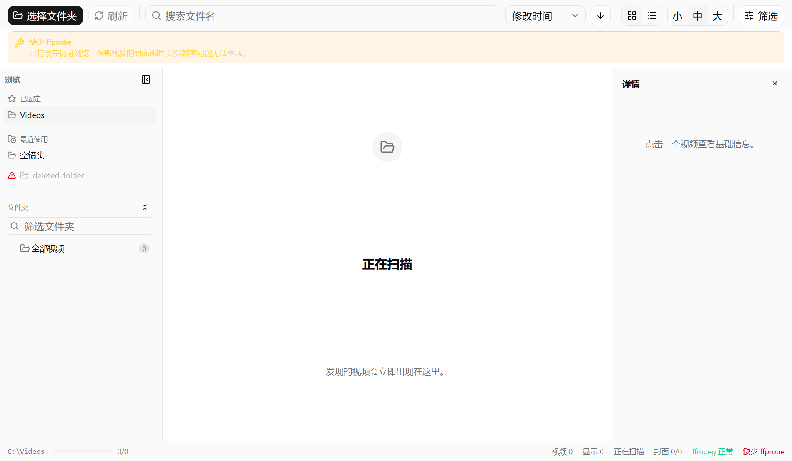
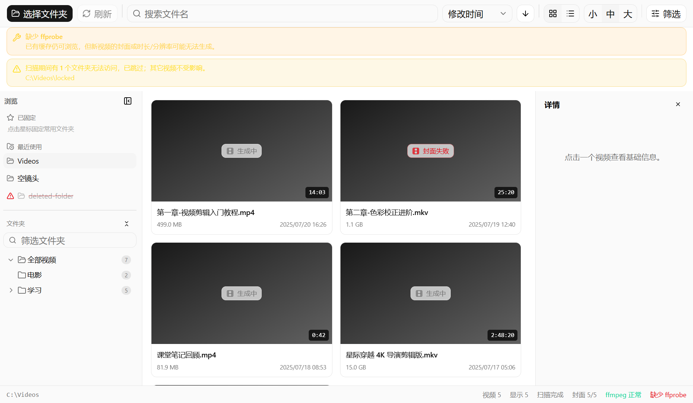

# Vid Folder Browser

> 一个轻量级的本地视频文件夹浏览器：选中文件夹即扫描，用封面、文件名、时长与技术信息，在几千个视频里快速找到你想要的。

它不是播放器，也不是复杂素材管理器——它是“带封面预览的视频文件夹浏览器”。

[](https://github.com/csyccc111/VidFolder/releases)
[](https://github.com/csyccc111/VidFolder/releases)
[](https://www.electronjs.org/)
[](https://github.com/csyccc111/VidFolder/releases)

---

## 为什么用它

- **快**：元信息与封面全部缓存，二次扫描秒级完成；缺失/损坏的封面自动自愈重建
- **深**：详情面板展示容器、编码、码率、帧率、音轨等完整技术信息
- **稳**：错误分类清晰、任务解耦互不拖累，缺 ffmpeg 也能浏览已有缓存

## 界面预览


| 网格视图 | 列表视图 |
| :---: | :---: |
|  |  |

> 截图使用模拟数据生成。

## 快速开始

1. 从 [GitHub Releases](https://github.com/csyccc111/VidFolder/releases) 下载 `Vid.Folder.Browser-*-win-x64.zip`
2. 解压后运行 `Vid Folder Browser.exe`
3. 点击 **选择文件夹**，开始浏览

**依赖**：本机需安装 `ffmpeg` 与 `ffprobe` 并加入系统 `PATH`（应用不内置、不自动下载）。缺失时仍可打开应用、浏览已有缓存；新视频的封面或元信息将无法生成。

## 功能

### 浏览与导航

- 记住上次打开路径，启动自动恢复；支持从资源管理器**拖入单个文件夹**直接打开（只读，不修改任何文件）
- **层级文件夹树**：按真实目录层级展示，显示直接/累计视频数；展开/折叠、名称过滤、全部折叠、右键“在资源管理器中打开”、完整键盘导航
- **快速访问**：自动记录最近成功打开的文件夹（上限 10 条），可固定常用项；失效路径自动标记，不影响启动
- 网格 / 列表视图切换，缩略图小/中/大三档；列表支持表头点击排序，列表行内嵌封面缩略图

### 技术详情（v0.8）

- 详情面板“技术信息”折叠区块：容器（`MP4 (isom)`）、编码（`H.264 (High, L4.1)`）、码率（缺失时按大小/时长估算并标注）、帧率、音轨列表（编码/声道/采样率/语言）
- 列表视图可选“编码”列（`h264` / `hevc` 短名），筛选面板内开关、设置持久化
- 基于 `ffprobe` 深度解析（`-show_streams -show_format`），解析层独立可复用；单字段缺失按“未知”兜底，不拖累既有信息

### 搜索、排序与筛选

- 文件名实时搜索；按文件名、修改时间、大小、时长排序（升降序切换）
- 按**格式**、**时长**（1 分钟内 / 1-20 分钟 / 20 分钟以上）、**画面**（横竖屏、方形、720p+、1080p+、4K+）组合筛选，一键清除

### 快捷键

| 操作 | 快捷键 |
| --- | --- |
| 打开视频（系统默认播放器） | 双击卡片/行，或选中后 `Enter` |
| 移动选择 | 方向键（网格按列数换行） |
| 复制完整路径 | `Ctrl+C` |
| 在文件夹树中定位当前视频 | 详情面板按钮 |

### 扫描与缓存

- 递归扫描 `.mp4` `.mkv` `.avi` `.mov` `.wmv` `.flv` `.webm` `.m4v`
- 扫描增量推送结果，支持刷新与取消；子目录不可读跳过并提示，根目录不可读明确报错
- 封面与元信息缓存按“路径 + 大小 + 修改时间”失效；缺失/损坏的封面自动重新生成（自愈）
- 元信息与封面任务解耦：一方失败不阻断另一方；旧缓存自动兼容，重扫自然补全

### 界面与体验

- 紧凑暗色界面（shadcn/ui + Tailwind + Radix），文件夹树可折叠拖宽、详情面板可收起
- 窄窗口（< 1100px）下详情自动切换为侧滑覆盖层
- 视图、排序、树展开、侧栏/详情栏状态全部持久化
- 右键菜单：打开所在目录、默认播放器打开、复制路径、重新生成封面

## 从源码构建

要求：Node.js 18+、npm、Windows、ffmpeg/ffprobe。

```bash
npm install        # 安装依赖
npm run dev        # 开发模式（Vite + Electron，自动启动）
npm run build      # 类型检查 + 前端 + 主进程构建
npm run dist:zip   # 生成 Windows x64 zip 发布包（release/）
npm test           # 单元测试
npm run typecheck  # 类型检查
```

> PowerShell 执行策略限制时用 `npm.cmd run dev`。

构建产物目录（不入库）：`dist/`（前端）、`dist-electron/`（主进程）、`release/`（发布包）。

UI 回归冒烟脚本（真实 Electron + ffmpeg，覆盖各版本功能）：`scripts/smoke-dom.cjs`、`scripts/smoke-v08.cjs`。

## 项目结构

```text
src/
  App.tsx                # 状态编排与顶层布局
  components/ui/         # shadcn/ui 基础组件（项目内维护）
  components/            # 侧栏、文件夹树、快速访问、网格/列表、详情、状态栏
  lib/                   # 纯逻辑：路径、树、历史、筛选排序、格式化、媒体信息解析
  shared.ts              # 渲染进程与主进程共享类型
electron/
  main.ts                # 主进程：扫描、ffprobe/ffmpeg、缓存、IPC
  preload.cts            # contextBridge 安全暴露 API
scripts/                 # 冒烟测试与发布工具
docs/                    # 质量文档与各版本验证记录
```

## 已知限制

- 依赖本机 `ffmpeg` 与 `ffprobe`，不内置、不自动下载（v0.9 规划中）。
- 缓存失效基于“路径 + 大小 + 修改时间”；内容变化但三者均不变时可能命中旧缓存（明确接受的边界，不引入全文件哈希）。
- 首次扫描（冷缓存）需逐视频执行 ffprobe/ffmpeg，耗时与视频数量正相关；二次扫描（热缓存）明显更快。
- 不提供实时文件监控：文件夹内容变化后需手动刷新。

## 数据位置

应用数据目录（`%APPDATA%/vid-folder-browser`）：

- `cache/`：封面缩略图
- `metadata-cache.json`：元信息与缩略图状态（损坏时自动备份 `.corrupt-<时间戳>` 并安全回退）
- `settings.json`：界面偏好与历史记录

## 质量文档

- `docs/performance-benchmark-guide.md`：大目录性能基准
- `docs/cache-validation-record.md`：缓存失效验证场景
- `docs/smoke-test-checklist.md`：发布前人工冒烟清单
- `docs/release-checklist.md`：发布流程（SHA-256 核验）
- `docs/v0.5-ui-regression.md` / `docs/v0.6-preview-validation.md` / `docs/v0.7-browse-validation.md` / `docs/v0.8-detail-validation.md`：各版本验证记录

## 非目标功能

刻意不做：内置播放器、删除/移动/重命名、标签与收藏、批量管理、复杂素材库、云同步、登录系统。
