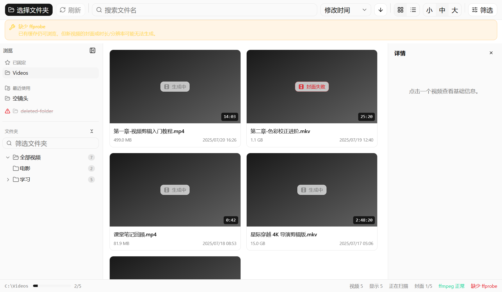

# Vid Folder Browser · 视频文件浏览器

一个轻量级桌面应用：选择本地文件夹，递归扫描其中的视频，用封面、文件名、大小、时长和基础信息帮你快速找到目标视频。

定位是“带封面预览的视频文件夹浏览器”——不是播放器，也不是复杂素材管理器。

> 当前版本：**v0.6.0**（Windows x64）

## 界面预览



> 上图为使用模拟数据生成的界面截图（网格视图 + 文件夹树 + 快速访问 + 详情面板）。

## 功能

### 浏览与导航

- 选择本地文件夹，记住上次打开路径，启动自动恢复
- **层级文件夹树**：按目录层级展示视频文件夹，显示直接/累计视频数；支持展开/折叠、名称过滤、全部折叠、选中节点自动展开祖先、右键“在资源管理器中打开”
- **快速访问**：自动记录最近成功打开的文件夹（最多 10 条、按时间排序、路径去重），可固定常用文件夹；失效路径会标记提示且不影响启动
- **拖入打开**：从资源管理器把单个文件夹拖进窗口即可打开（多目标/文件会给出提示，不会修改目录中任何文件）
- 网格视图 / 列表视图切换，缩略图小/中/大三档

### 扫描与缓存

- 递归扫描 `.mp4` `.mkv` `.avi` `.mov` `.wmv` `.flv` `.webm` `.m4v`
- 扫描过程增量显示结果，支持刷新与取消；不可读子目录跳过并提示，根目录不可读明确报错
- `ffprobe` 读取时长、分辨率；`ffmpeg` 生成 16:9 封面
- 封面与元信息缓存到应用数据目录，按“路径 + 大小 + 修改时间”判断失效；缺失/损坏的封面自动重新生成（自愈）
- 元信息与封面任务解耦：一方失败不阻断另一方；启动时检测 `ffmpeg`/`ffprobe`，缺失时仍可浏览已有缓存

### 搜索、排序与筛选

- 文件名实时搜索；按文件名、修改时间、大小、时长排序（升降序切换，列表视图表头可点击排序）
- 按格式、时长（1 分钟内 / 1-20 分钟 / 20 分钟以上）、画面方向与分辨率（横竖屏、方形、720p+、1080p+、4K+）筛选
- 所有条件可组合，一键清除；筛选面板显示当前生效条件数量

### 快捷键

| 操作 | 快捷键 |
| --- | --- |
| 打开视频（系统默认播放器） | 双击卡片/行，或选中后 `Enter` |
| 移动选择 | 方向键（网格按列数换行） |
| 复制完整路径 | `Ctrl+C` |
| 在文件夹树中定位当前视频 | 详情面板按钮 |

### 界面与体验

- 顶部紧凑工具栏；左侧可折叠、可拖拽调宽的侧栏；右侧可收起的详情面板；底部状态栏
- 窄窗口（< 1100px）下详情自动切换为侧滑覆盖层，不与主内容重叠
- 树展开状态、侧栏状态、详情栏状态、视图/排序/缩略图偏好全部持久化
- 右键菜单：打开所在目录、默认播放器打开、复制路径、重新生成封面
- 基于 shadcn/ui（Tailwind + Radix）的统一组件体系，暗色、紧凑、克制

### 悬停多帧预览（v0.6）

- 网格封面停留约 400ms 后激活：在封面内水平移动鼠标即可预览视频不同时间位置的画面，角标实时显示对应时间
- 按需抽帧：只有悬停才会生成预览帧（一次 ffmpeg 调用生成 8 帧），扫描阶段不预生成；预览失败自动回退静态封面
- 预览帧独立缓存（`preview-cache/`），默认容量上限 512 MiB，按最近使用整组淘汰
- 工具栏可开关悬停预览（设置持久化），缺少 ffmpeg 时自动禁用并说明原因；工具栏"预览缓存"面板可查看占用并一键清理

## 下载使用

发布版位于 GitHub Releases：

<https://github.com/csyccc111/VidFolder/releases>

下载 `Vid.Folder.Browser-*-win-x64.zip`，解压后运行 `Vid Folder Browser.exe`。

**依赖**：本机需安装 `ffmpeg` 与 `ffprobe` 并加入系统 `PATH`（应用不内置、不自动下载）。缺失时应用仍可打开和浏览已有缓存，但新视频的封面或时长/分辨率可能无法生成。

## 从源码运行

要求：Node.js 18+、npm、Windows、ffmpeg/ffprobe。

```bash
npm install        # 安装依赖
npm run dev        # 启动开发模式（Vite + Electron）
```

> PowerShell 执行策略限制时用 `npm.cmd run dev`。

## 构建与打包

```bash
npm run build      # 类型检查 + 前端 + 主进程构建
npm run dist:zip   # 生成 Windows x64 zip 发布包（release/）
```

构建产物目录（不提交到仓库）：

- `dist/`：前端构建结果
- `dist-electron/`：Electron 主进程构建结果
- `release/`：electron-builder 发布包

## 测试

```bash
npm test          # 聚焦单元测试（路径归一化、树构造、历史去重/淘汰）
npm run typecheck # 类型检查
```

UI 回归冒烟：`scripts/smoke-dom.cjs`（Electron 无头加载构建产物 + 模拟 IPC，18 项 DOM 断言），详见 `docs/v0.5-ui-regression.md`。

## 项目结构

```text
src/
  App.tsx                # 状态编排与顶层布局
  components/ui/         # shadcn/ui 基础组件（项目内维护）
  components/            # 侧栏、文件夹树、快速访问、网格/列表、详情、状态栏
  lib/                   # 纯逻辑：路径、树构造、历史记录、筛选排序、格式化
  shared.ts              # 渲染进程与主进程共享类型
electron/
  main.ts                # 主进程：扫描、ffprobe/ffmpeg、缓存、IPC
  preload.cts            # contextBridge 安全暴露 API
prompts/                 # 版本化增量开发提示词（05 = v0.5，06 = v0.6 规划）
```

> 发布（GitHub Releases 流程、SHA-256 核验）由维护者执行，步骤见 `docs/release-checklist.md`。

## 已知限制

- 依赖本机 `ffmpeg` 与 `ffprobe`，不内置、不自动下载。
- 缓存失效基于“路径 + 大小 + 修改时间”；**内容变化但三者均不变**时可能命中旧缓存（v0.4 明确接受的边界，不引入全文件哈希）。
- 首次扫描（冷缓存）需逐视频执行 ffprobe/ffmpeg，耗时与视频数量正相关；二次扫描（热缓存）明显更快。
- 不可读子目录会跳过并提示；根目录不可读直接报告扫描失败。
- 不提供实时文件监控：文件夹内容变化后需手动刷新。

## 数据位置

应用数据目录（`%APPDATA%/vid-folder-browser`）：

- `cache/`：封面缩略图
- `preview-cache/`：悬停多帧预览帧（独立容量治理，可一键清理）
- `metadata-cache.json`：元信息与缩略图状态（损坏时自动备份为 `.corrupt-<时间戳>` 并回退空缓存）
- `settings.json`：上次文件夹、界面偏好、最近/固定文件夹、树展开状态、侧栏与详情栏状态、悬停预览开关

## 质量文档

- `docs/performance-benchmark-guide.md`：大目录性能基准（500/2000/5000+ 三档）
- `docs/cache-validation-record.md`：缓存失效验证场景与模板
- `docs/smoke-test-checklist.md`：发布前人工冒烟清单
- `docs/release-checklist.md`：发布流程清单
- `docs/v0.5-ui-regression.md`：v0.5 UI 重构回归记录
- `docs/v0.6-preview-validation.md`：悬停预览自动化验证与压力测试记录

## 非目标功能

刻意不做：内置播放器、删除/移动/重命名、标签与收藏、批量管理、复杂素材库、云同步、登录系统。

## 开发背景

初始需求与范围说明（AI 提示词）：[VIDEO_BROWSER_PROMPT.md](./VIDEO_BROWSER_PROMPT.md)。
